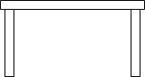
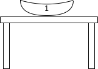
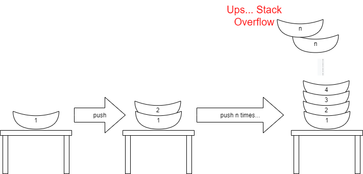
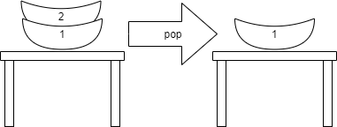
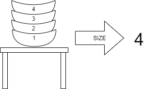

# Stack

The Stack is one of the simplest, and yet most basic data structures in computer science.
This data structure is often used at both software and hardware levels. There are many variations and complications of the Stack. Let's start with the simplest one.

A stack is an ordered collection of data elements, organized according to the LIFO (Last In First Out) principle. 
The most common abstraction for representing the stack is a stack of plates. You can take or put a plate only from the top of the stack. 
If you try to get access to a plate in the middle of the stack then smash all plates.

Let's try to understand this data structure using pictorial images and examples. 
As usual for any data structure, this will be done by parsing the stack methods

## Operations with Stack
Let's look at a stack using an example of a stack of plates. At the initial moment of time, the stack will be empty (contains no plates).
Just an empty table:

For us, as programmers, it is very important to understand that we not only have nothing, but we have a container (table) that we can fill. 

1. ### Add a New Element (PUSH)

    So, of course we can add a plate to this empty Stack:
    
    
    
    Our table (the Stack) is not enty already. It contains one element - one plate.
    Usually the operation of adding an element to the stack named "PUSH".
    
    We can do this operation again and again. But it is not so easy... The stack can overflow sometimes.
    
    

2. ### Get element from Stack (POP)
    The opposite operation for push is POP - get an item from the stack. But there are restrictions on this operation too. 
    Of course, you cannot get an item from an empty stack. And you can only get an item on top of the stack. It's just like a real stack of plates.
    There is one more restriction with data structure Stack than 
    
    

    The Stack data structure has a limitation as opposed to a stack of plates. You cannot get more than one item from the stack at a time.

3. Look at the element on the top of Stack (TOP)
    There are cases when you need to see only the plate on the top. For example, you need to see the number printed on the bottom of the plate.
    You don't need to get the plate from the stack, just see to the bottom:
    
    For this the stack must contain a method named TOP: 
    
    

    This method doesn't get out an element from the Stack. You can just look into the element on the top.

4. How many element in the Stack (SIZE)
    And the latest operation with stack - you can just get number of elements in the stack.
    For this operation you need to call the method "size":
    
