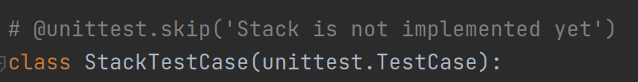
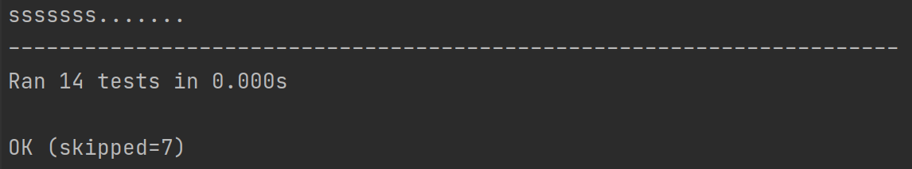
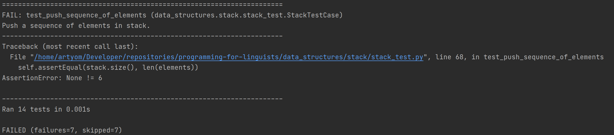

# Запуск тестов для проверки корректной реализации лабораторной работы

Один из критериев успешной сдачи лабораторных работ является прохождение тестов.

Тесты запускаются в CI при каждой заливке в [GitHub Actions]()
Но при разработке гораздо удобнее запускать тесты локально, потому что это занимает гораздо меньше времени и не требует 
манипуляций с git.


На каждую лабораторную работу уже написано некоторое количество тестов, которые проверяют, реализацию на корректность.
Каждому файлу с исходным кодом соответствует файл с тестами. Например, в лабораторной работе "[Стек](../data_structures/stack)" 
файлу с исходным кодом [stack.py](data_structures/stack/stack.py) соответствует файл с тестами  [stack_test.py](data_structures/stack/stack_test.py).

Так как в master ветке реализация отсутствует, то все тесты заскипаны (пропускаются при запуске), так как в противном случае они упадут.
Для запуска тестов на конкретную лабораторную работу необходимо:

1. Расскипать тесты для лабораторной работы. Для этого нужно удалить или закомментировать декоратор `unittest.skip` над всеми классами с тестами:
    

2. Запустить тесты командой:
    ```shell
    python -m unittest discover -p *_test.py
    ```
3. В случае успешного прохождения тестов в результате выполнения команды вы увидите следующее сообщение:
    
   
4. В случае, если тесты упали, будет выведено сообщение об ошибке:
    